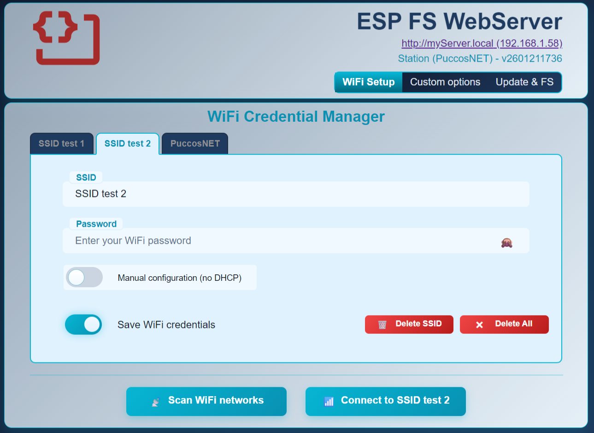
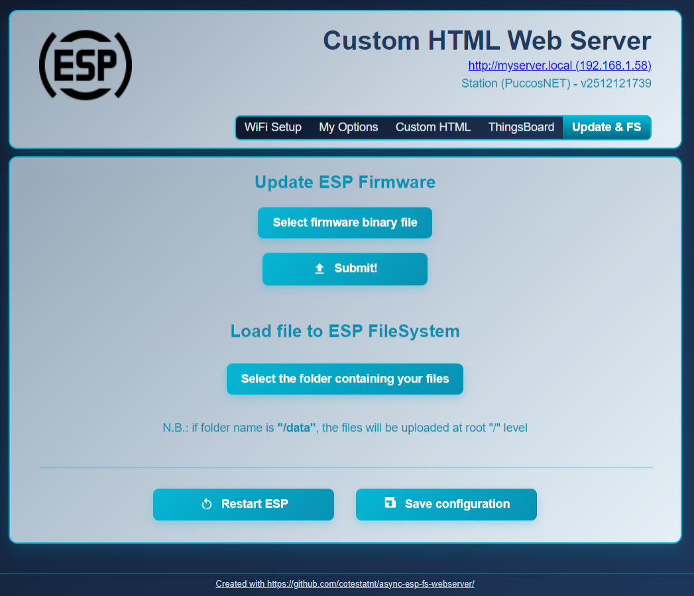
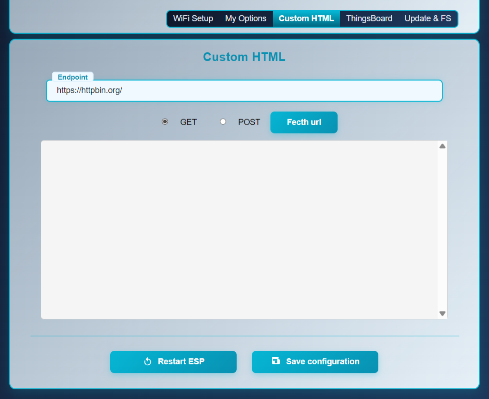
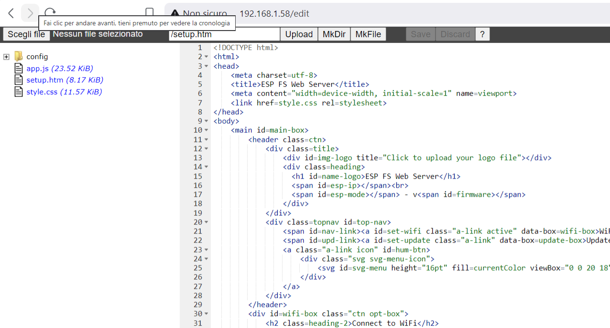

# ESP-FS-WebServer

A library for ESP8266/ESP32 that provides a web server with an integrated file system browser, WiFi configuration manager, and support for WebSockets. This library is based on the synchronous `WebServer` class.



## Features

-   **Dynamic WiFi Configuration**: An integrated setup page (`/setup`) allows you to scan for WiFi networks and connect the ESP to your local network. Passwords are stored using AES-256-CBC encryption (hardware on ESP32 platform) with multiple SSIDs manager (up to 5 different WiFi credentials).
-   **Powerful & Customizable UI**:
    -   Easily add your own configuration parameters (text boxes, checkboxes, sliders, dropdown lists) to the setup page.
    -   Inject custom **HTML, CSS, and JavaScript** snippets into the setup page to create rich, dynamic user interfaces for your specific project needs.
-   **Over-the-Air (OTA) Updates**: Update your device's firmware securely and conveniently through the web interface. You can easily upload also your entire web project's `data` folder to the ESP's filesystem.
-   **WebSocket Support**: Built-in support for real-time, two-way communication between the web client and the ESP.
-   **Advanced File Management**: An embedded file manager (`/edit`) allows you to browse, view, upload, and delete files and folders. 

## Documentation

For more detailed information, please refer to the documentation in the `docs` folder:

-   **[API Reference](docs/API.md)** – Detailed overview of the public methods.
-   **[Setup and WiFi](docs/SetupAndWiFi.md)** – Guide to `startWiFi()`, captive portal, and the `/setup` page.
-   **[Filesystem and Editor](docs/FileEditorAndFS.md)** – How to serve static files and use the `/edit` page.
-   **[WebSocket](docs/WebSocket.md)** – Information on using the WebSocket server.

## Dependencies

-   ESP8266/ESP32 Core for Arduino

## Basic Usage

```cpp
#include <FS.h>
#include <LittleFS.h>
#if defined(ESP8266)
#include <ESP8266WiFi.h>
#else
#include <WiFi.h>
#endif
#include "FSWebServer.h"

// Use LittleFS
fs::FS& filesystem = LittleFS;

FSWebServer server(80, filesystem, "esphost");

void setup() {
  Serial.begin(115200);

  // Initialize Filesystem
  if (!filesystem.begin()) {
    Serial.println("Error mounting file system.");
    return;
  }

  // Start WiFi (or captive portal if no credentials)
  server.startWiFi(10000);

  // Add a handler for the root page
  server.on("/", []() {
    server.send(200, "text/html", "<h1>Hello from FSWebServer!</h1>");
  });

  // Start the server
  server.begin();
  Serial.println("HTTP server started.");
}

void loop() {
  server.run();
}
```
### Custom application "options manager"


### OTA update and `data` folder upload


### Custom 'code snippets'


### ACE file editor

